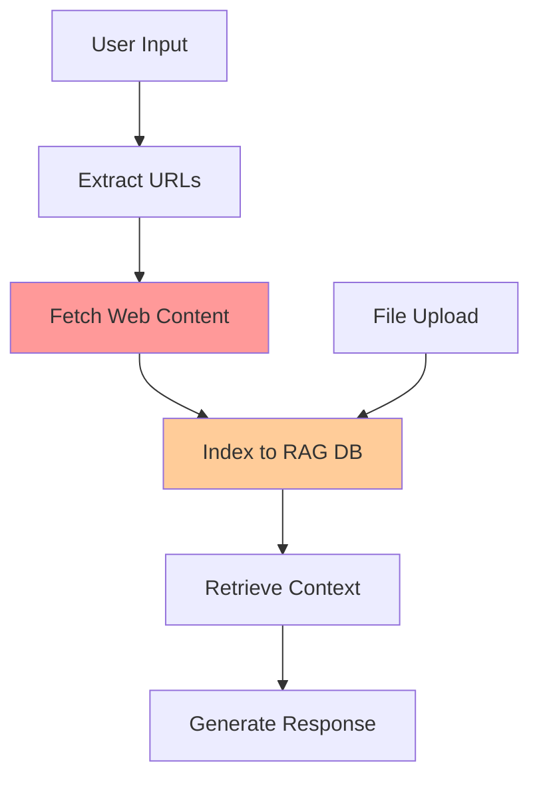
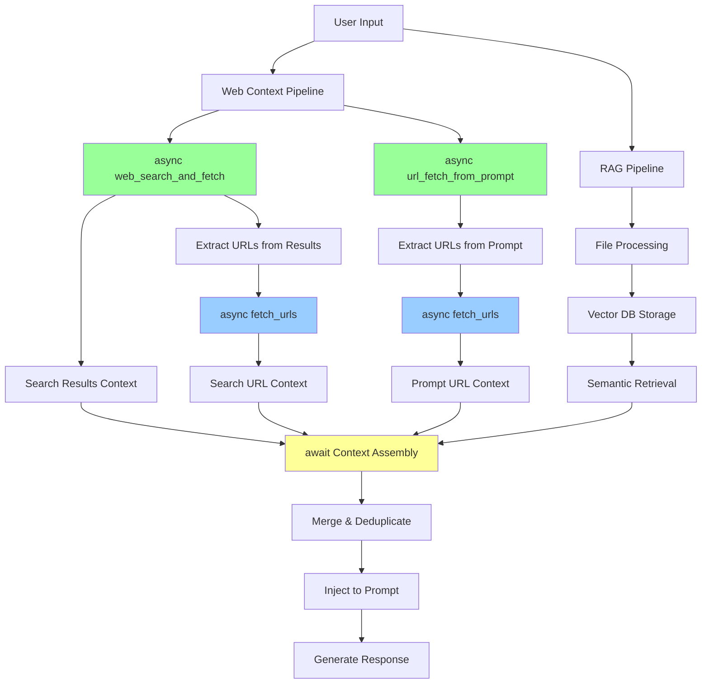

# ADR-002: Web-Based Context Independence from RAG System

**Status:** Accepted  
**Date:** 2025-08-15  

## Context

The current chatbot application processes web content through the RAG (Retrieval-Augmented Generation) system, which involves:
1. Extracting URLs from user messages
2. Fetching web content synchronously during user interaction
3. Indexing content into Qdrant vector database
4. Retrieving relevant chunks through semantic similarity search

This approach has limitations:
- **Blocking operations** during user interaction
- **Stale web content** cached in vector database
- **Mixed concerns** between persistent document storage and real-time web data
- **Inefficient for dynamic content** like news or real-time information

## Decision

We propose separating web-based context processing from the RAG system by implementing a dedicated **Web Context Pipeline** that operates independently and asynchronously.

## Proposed Architecture

### Current Architecture (Simplified)

*Red: Blocking operation, Orange: Storage overhead*

### Proposed Architecture

*Green: Async components, Blue: Background processing, Yellow: Context merging*

## Implementation Strategy

### Phase 1: Core Web Pipeline
1. **Async Web Search Function**
   - Leverage existing `chatbot/search/` infrastructure
   - `async def web_search_and_fetch(prompt)` - searches and fetches URLs from results
   - Parse results into context + extract URLs for fetching

2. **Async URL Fetch Function**
   - Extend `chatbot/utils/web.py:extract_urls_from_text`
   - `async def url_fetch_from_prompt(prompt)` - extracts and fetches URLs from prompt
   - `async def fetch_urls(urls)` - shared function for concurrent URL fetching
   - Add trafilatura for content sanitization

### Phase 2: Context Assembly
1. **Async Context Coordination**
   - Use `asyncio.gather()` to await all async functions simultaneously
   - `search_context, prompt_urls_context, rag_context = await asyncio.gather(...)`
   - Merge search results context + URL fetch contexts + RAG context

2. **Context Merging Logic**
   - Implement deduplication logic for overlapping content
   - Apply relevance filtering and ranking
   - Smart merging strategies for different context types

### Phase 3: Optimization
1. **Caching Layer**
   - Short-term cache for frequently accessed URLs
   - Configurable TTL for different content types

2. **Context Quality**
   - Relevance scoring
   - Content summarization
   - Context window optimization

## Alternatives Considered

### Alternative 1: Enhance Current RAG System
- **Pros:** Minimal changes, consistent architecture
- **Cons:** Still blocking, stale data, mixed concerns
- **Verdict:** Doesn't address core limitations

### Alternative 2: Pure Direct Injection
- **Pros:** Always fresh data, simple pipeline
- **Cons:** No semantic retrieval, no file processing
- **Verdict:** Too limiting for document-based queries

### Alternative 3: Hybrid with Smart Routing
- **Pros:** Best of both worlds, intelligent context selection
- **Cons:** Complex routing logic, potential inconsistencies
- **Verdict:** Future enhancement after core implementation

## Trade-offs

### Benefits
- **Real-time web data**: Fresh content for every query
- **Non-blocking UX**: Async processing improves responsiveness
- **Separation of concerns**: Clear distinction between persistent docs and web content
- **Better search integration**: Proactive context discovery vs reactive URL processing
- **Scalable architecture**: Independent scaling of web vs RAG components

### Costs
- **Implementation complexity**: New async pipeline and context assembly
- **Resource usage**: Parallel web fetching may increase bandwidth/latency
- **Context management**: More sophisticated merging and deduplication logic
- **Testing complexity**: Async components harder to test

### Risks
- **Performance degradation**: If web fetching is consistently slow
- **Context quality**: Raw web content may be less relevant than semantic retrieval
- **Maintenance overhead**: Two separate context systems to maintain

## Success Metrics

1. **Performance**
   - Response latency: Target <2s for web-enhanced responses
   - Context relevance: User feedback on context quality
   - System throughput: Concurrent users supported

2. **Quality**
   - Context freshness: Timestamp tracking for web content
   - Deduplication effectiveness: Measure context overlap reduction
   - User satisfaction: Feedback on response quality

3. **Reliability**
   - Web fetch success rate: >90% for accessible URLs
   - Fallback behavior: Graceful degradation when web services fail
   - Error handling: Proper logging and monitoring

## Consequences

### Positive
- Users get access to real-time web information
- Improved system responsiveness through async processing
- Better architectural separation enabling independent optimization
- Enhanced search capabilities beyond reactive URL processing

### Negative
- Increased system complexity
- Potential for inconsistent context quality
- Higher resource requirements for parallel processing
- Need for sophisticated context merging strategies

### Neutral
- RAG system remains unchanged for file processing
- Existing URL extraction logic can be reused
- Search infrastructure already exists in codebase

## Related Decisions

- Future ADR needed for context caching strategy
- Future ADR needed for context quality scoring
- Consider ADR for search provider selection and fallback strategies

## References

- Current implementation: `chatbot/app.py:67` (blocking web processing)
- URL extraction: `chatbot/utils/web.py:extract_urls_from_text`
- Search infrastructure: `chatbot/search/` directory
- RAG processor: `chatbot/rag.py`