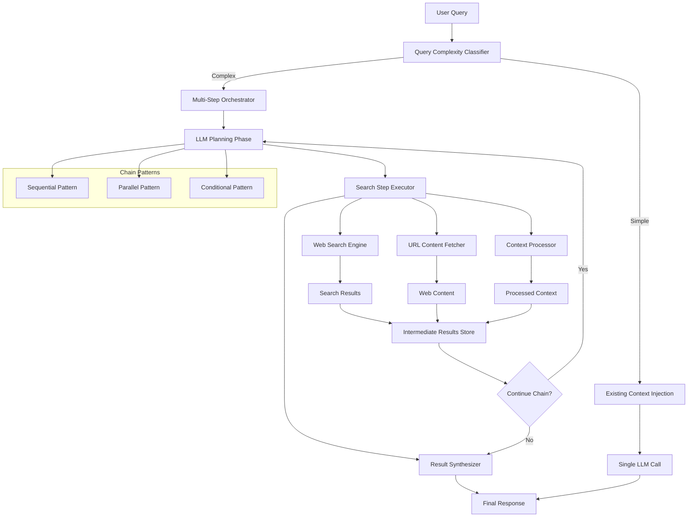

# ADR-008: Multi-Step Reasoning Architecture via Intelligent Chain Orchestration

## Status

Proposed

## Context

Current web search uses static context injection effective for simple queries but limited for complex multi-step reasoning: no query refinement, follow-up exploration, reasoning chains, or depth investigation due to static context windows.

Research shows ReAct Framework outperforms traditional RAG on multi-hop tasks, Chain of Agents beats RAG/long context LLMs significantly, and traditional RAG struggles with multi-piece reasoning.

## Decision

Implement **Intelligent Chain Orchestration**: LLM planning + application execution + query complexity routing between simple context injection and complex multi-step reasoning. Provides tool calling reasoning benefits without cost/reliability issues.

## Design Highlights

**Hybrid Control**: LLM determines strategy, application orchestrates execution with observability, single planning call vs multiple tool overhead.
**Classification**: Simple queries → existing context injection; complex queries → multi-step orchestration.
**Patterns**: Sequential (timeline), parallel (comparison), conditional (investigation).
**Learning**: Track pattern effectiveness, optimize via user satisfaction.

## Architecture



## Implementation Plan

**Phase 1**: Query classifier (keywords/entities), basic sequential orchestrator alongside existing injection.
**Phase 2**: Parallel/conditional patterns, caching, adaptive stopping.
**Phase 3**: User feedback, pattern tracking, automated classification improvement.

## Key Components

### 1. Query Complexity Classifier

```python
class QueryComplexityClassifier:
    def __init__(self):
        self.complex_indicators = [
            "compare", "analyze", "investigate", "timeline", "evolution",
            "relationship", "impact", "cause", "effect", "trends"
        ]
        self.entity_threshold = 2  # Multiple entities suggest complexity
    
    def classify(self, query: str) -> QueryComplexity:
        """Classify query as SIMPLE or COMPLEX based on patterns."""
        indicators_found = sum(1 for indicator in self.complex_indicators 
                             if indicator in query.lower())
        entities = self.extract_entities(query)
        
        if indicators_found >= 1 or len(entities) >= self.entity_threshold:
            return QueryComplexity.COMPLEX
        return QueryComplexity.SIMPLE
    
    def extract_entities(self, query: str) -> list[str]:
        """Extract named entities from query."""
        # Implementation using spaCy or similar NLP library
        pass
```

### 2. Multi-Step Search Orchestrator

```python
class MultiStepSearchOrchestrator:
    def __init__(self, web_context_pipeline: WebContextPipeline):
        self.web_pipeline = web_context_pipeline
        self.llm_client = get_llm_client()
    
    async def execute_complex_query(self, query: str) -> OrchestrationResult:
        """Execute multi-step reasoning chain for complex queries."""
        
        # Phase 1: LLM Planning
        search_plan = await self.create_search_plan(query)
        
        # Phase 2: Execution with state tracking
        execution_state = ExecutionState()
        
        for step_idx, step in enumerate(search_plan.steps):
            step_result = await self.execute_step(step, execution_state)
            execution_state.add_result(step_idx, step_result)
            
            # Adaptive stopping: check if we have sufficient information
            if await self.should_stop_chain(execution_state, query):
                break
                
            # Adaptive refinement: adjust next steps based on results
            if step_idx < len(search_plan.steps) - 1:
                await self.refine_remaining_steps(
                    search_plan, step_idx + 1, execution_state
                )
        
        # Phase 3: Synthesis
        final_result = await self.synthesize_results(execution_state, query)
        return OrchestrationResult(
            query=query,
            execution_state=execution_state,
            final_result=final_result,
            metadata=self.generate_metadata(execution_state)
        )
```

### 3. Search Plan Generation

```python
async def create_search_plan(self, query: str) -> SearchPlan:
    """Use LLM to create structured search strategy."""
    
    planning_prompt = f"""
    Analyze this query and create a multi-step search plan: "{query}"
    
    Consider:
    1. What key information needs to be gathered?
    2. What order should searches be performed?
    3. How might early results inform later searches?
    4. What entities, topics, or timeframes are involved?
    
    Return a JSON plan with steps:
    {{
        "reasoning": "Brief explanation of the approach",
        "pattern": "sequential|parallel|conditional",
        "steps": [
            {{
                "id": 1,
                "type": "search|refine|synthesize",
                "query": "specific search terms",
                "focus": "what to look for in results",
                "depends_on": [list of step IDs this depends on]
            }}
        ],
        "stopping_criteria": "when to stop the chain"
    }}
    """
    
    response = await self.llm_client.generate(planning_prompt)
    return SearchPlan.from_json(response)
```

### 4. Adaptive Step Execution

```python
async def execute_step(self, step: SearchStep, state: ExecutionState) -> StepResult:
    """Execute a single step in the reasoning chain."""
    
    if step.type == "search":
        # Perform web search with context from previous steps
        search_context = state.get_relevant_context(step.depends_on)
        enhanced_query = self.enhance_query_with_context(step.query, search_context)
        
        search_results = await self.web_pipeline.web_search_and_fetch(
            enhanced_query, state.http_client, num_results=step.num_results
        )
        
        return StepResult(
            step_id=step.id,
            type="search",
            content=search_results,
            metadata={"enhanced_query": enhanced_query}
        )
    
    elif step.type == "refine":
        # Refine understanding based on previous results
        relevant_results = state.get_results(step.depends_on)
        refined_context = await self.refine_information(
            step.focus, relevant_results
        )
        
        return StepResult(
            step_id=step.id,
            type="refine",
            content=refined_context,
            metadata={"focus": step.focus}
        )
    
    elif step.type == "synthesize":
        # Synthesize findings from multiple steps
        all_results = state.get_all_results()
        synthesis = await self.synthesize_information(all_results, step.focus)
        
        return StepResult(
            step_id=step.id,
            type="synthesize", 
            content=synthesis,
            metadata={"synthesis_focus": step.focus}
        )
```

### 5. Intelligent Stopping Criteria

```python
async def should_stop_chain(self, state: ExecutionState, original_query: str) -> bool:
    """Determine if reasoning chain should continue or stop."""
    
    # Check if we have sufficient information
    completeness_score = await self.assess_completeness(state.get_all_results(), original_query)
    
    # Check resource constraints
    if state.step_count >= self.max_steps:
        return True
        
    if state.total_cost >= self.max_cost:
        return True
    
    # Check diminishing returns
    if len(state.results) >= 2:
        recent_quality = self.assess_result_quality(state.results[-1])
        previous_quality = self.assess_result_quality(state.results[-2])
        
        if recent_quality < previous_quality * 0.8:  # Diminishing returns
            return True
    
    # Check completeness threshold
    return completeness_score >= 0.85
```

## Benefits

**Cost**: Single planning call vs 400-550+ tokens per tool function, predictable execution costs.
**Performance**: Lower latency programmatic orchestration, improved reliability, deterministic execution.
**Reasoning**: Multi-hop capability, adaptive strategy refinement, context accumulation.
**Maintainability**: Clear LLM/application separation, independent testing, extensible patterns.

## Considerations

**Complexity**: Increased system complexity, sophisticated caching/state management, additional monitoring.
**Resources**: Memory for execution state, longer response times, timeout/circuit breaker patterns.
**UX**: Multi-step processing indication, progressive disclosure, fallback mechanisms.

## Success Metrics

**Performance**: User satisfaction, cost efficiency vs tool calling, P95 latency.
**System**: Classification accuracy, chain completion rate, resource utilization.
**User**: Query complexity distribution, engagement improvements, feature adoption.

## Migration Strategy

**Parallel**: Build alongside existing injection, feature flag rollout, A/B testing.
**Gradual**: Start sequential patterns, add parallel/conditional incrementally, refine classification.
**Monitoring**: Comprehensive chain monitoring, automatic fallback, quick rollback.

## Alternatives Considered

**Full Tool Calling**: Rejected - higher cost, less predictable performance.
**Enhanced Single-Shot RAG**: Rejected - cannot handle multi-hop reasoning.
**External Frameworks**: Rejected - dependency overhead, less control.

## References

1. ReAct: Synergizing Reasoning and Acting in Language Models - Google Research
2. Chain of Agents: Large language models collaborating on long-context tasks - Google Research  
3. Multi-Hop Reasoning Challenges in RAG Systems - 2024 studies
4. LLM Orchestration vs Tool Calling Performance Analysis - Industry benchmarks
5. Cost Analysis: Tool Calling vs Application Orchestration - OpenAI API usage studies