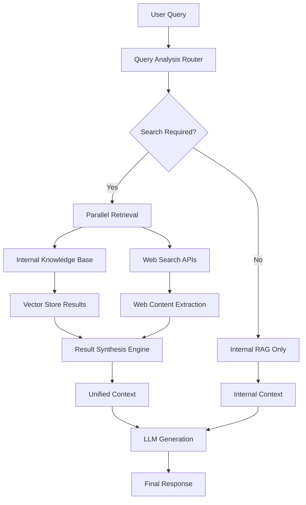

# Feature Request: Web Search Integration with RAG System

**Created:** 2025-08-03  
**Author:** Sarthak Joshi  
**Status:** Proposal  

## Summary

Implement a comprehensive web search integration with the existing RAG (Retrieval-Augmented Generation) system to combine real-time web information with static knowledge bases through intelligent query routing, parallel retrieval, and sophisticated result synthesis.

## Problem Statement

**Current Limitations:**
- RAG system is limited to static knowledge bases, creating knowledge cutoffs
- Missing current information and real-time data
- No intelligent routing between internal documents and web search
- Limited to URL extraction from user messages rather than proactive search

**Impact:**
- Users cannot get up-to-date information on current events
- Responses may contain outdated information
- Reduced system utility for time-sensitive queries

## Proposed Solution

Implement a hybrid retrieval system that intelligently combines internal documents with real-time web search results through advanced synthesis techniques, following the design outlined in `brainstorming/claude/web_search_rag.md`.

### High-Level Architecture

## Implementation Plan

### Phase 1: Basic Web Search Integration (4-6 weeks)
**Priority: High**

#### 1.1 Search API Integration (Week 1-2)
- [ ] Create `chatbot/search/` module with API clients
- [ ] Implement Google Search API and Brave Search connectors
- [ ] Add search API credentials to settings configuration
- [ ] Basic search result fetching with metadata (title, URL, snippet)

#### 1.2 Enhanced Content Processing (Week 2-3)
- [ ] Extend `chatbot/utils/web.py` with search result processing
- [ ] Implement content extraction for search results
- [ ] Add metadata preservation (search rank, snippet, domain authority)
- [ ] Integrate search results into existing RAG indexing pipeline

#### 1.3 Basic Query Triggering (Week 3-4)
- [ ] Simple keyword-based search triggering (detect "latest", "current", "recent")
- [ ] Manual override flag for forcing web search
- [ ] Combine search results with existing internal RAG results
- [ ] Basic result ordering (search results first, then internal)

#### 1.4 Testing & Integration (Week 4-6)
- [ ] Unit tests for search API integration
- [ ] End-to-end testing with real search queries
- [ ] Performance baseline measurement
- [ ] Error handling for API failures and rate limits

**Deliverables:**
- Working search API integration
- Enhanced web content processing
- Basic search triggering mechanism
- Test suite and documentation

### Phase 2: Query Routing & Intent Classification (3-4 weeks)
**Priority: High**

#### 2.1 Intent Classification System (Week 1-2)
- [ ] Create `chatbot/routing/` module with query analyzer
- [ ] Implement temporal keyword detection (regex + LLM-based)
- [ ] Entity recognition for unknown entities (using spaCy/NLTK)
- [ ] Query classification model (rule-based initially, ML later)

#### 2.2 Smart Query Routing (Week 2-3)
- [ ] Decision engine for search necessity scoring
- [ ] Query expansion for better search results
- [ ] Parallel execution framework (internal + web search)
- [ ] Configurable thresholds for search triggering

#### 2.3 Context Assembly Strategy (Week 3-4)
- [ ] Intelligent merging of internal and web results
- [ ] Source attribution and metadata preservation
- [ ] Context window optimization for LLM consumption
- [ ] Citation format for web sources

**Deliverables:**
- Query intent classification system
- Smart routing decision engine
- Parallel retrieval orchestration
- Enhanced context assembly

### Phase 3: Advanced Synthesis & Re-ranking (4-5 weeks)
**Priority: Medium**

#### 3.1 Cross-Source Re-ranking (Week 1-2)
- [ ] Implement Reciprocal Rank Fusion (RRF) algorithm
- [ ] Cross-encoder re-ranking model integration
- [ ] Authority weighting (domain reputation, PageRank)
- [ ] Freshness scoring for time-sensitive content

#### 3.2 Advanced Quality Control (Week 2-3)
- [ ] Enhanced deduplication across internal and web sources
- [ ] Conflict detection and resolution algorithms
- [ ] Source diversity enforcement
- [ ] Content quality filtering (spam detection, reliability scoring)

#### 3.3 Multi-hop Reasoning (Week 3-4)
- [ ] Follow-up query generation for knowledge gaps
- [ ] Iterative search refinement
- [ ] Cross-document relationship analysis
- [ ] Structured information organization

#### 3.4 Result Synthesis Engine (Week 4-5)
- [ ] Information fusion strategies (extractive + abstractive)
- [ ] Confidence scoring for synthesized content
- [ ] Structured response generation with clear citations
- [ ] Hallucination detection and prevention

**Deliverables:**
- Advanced re-ranking system
- Quality control pipeline
- Multi-hop reasoning capability
- Sophisticated synthesis engine

### Phase 4: Performance Optimization & Monitoring (3-4 weeks)
**Priority: Medium**

#### 4.1 Caching Infrastructure (Week 1-2)
- [ ] Redis-based search result caching
- [ ] Query similarity matching for cache hits
- [ ] TTL strategies for different content types
- [ ] Cache invalidation and refresh mechanisms

#### 4.2 Performance Monitoring (Week 2-3)
- [ ] Metrics collection (latency, accuracy, cache hit rates)
- [ ] Quality assessment framework (relevance scoring)
- [ ] A/B testing infrastructure for algorithm improvements
- [ ] Real-time monitoring dashboards

#### 4.3 Scalability Enhancements (Week 3-4)
- [ ] Async processing optimizations
- [ ] Rate limiting and quota management
- [ ] Load balancing for multiple search APIs
- [ ] Resource usage optimization

#### 4.4 Production Readiness (Week 4)
- [ ] Error handling and graceful degradation
- [ ] Configuration management and feature flags
- [ ] Documentation and deployment guides
- [ ] Security review and compliance

**Deliverables:**
- Production-grade caching system
- Comprehensive monitoring and metrics
- Scalable architecture
- Complete documentation and deployment package

## Success Metrics

### Quality Metrics
- [ ] Response relevance score improvement (target: +25%)
- [ ] Source attribution accuracy (target: >95%)
- [ ] Conflict resolution effectiveness
- [ ] User satisfaction ratings

### Performance Metrics
- [ ] End-to-end latency (target: <5s for web-enhanced responses)
- [ ] Cache hit rate (target: >60%)
- [ ] API usage efficiency
- [ ] System availability (target: >99.5%)

## Technical Requirements

### Dependencies
- [ ] Google Search API access
- [ ] Brave Search API access (alternative)
- [ ] Redis for caching infrastructure
- [ ] Enhanced vector database capacity
- [ ] Cross-encoder re-ranking models

### Configuration Changes
- [ ] New environment variables for search API keys
- [ ] Caching configuration settings
- [ ] Query routing thresholds and parameters
- [ ] Feature flags for gradual rollout

### Files to be Modified/Created
- `chatbot/search/` - New module for search API integration
- `chatbot/routing/` - New module for query analysis and routing
- `chatbot/synthesis/` - New module for result fusion and re-ranking
- `chatbot/utils/web.py` - Enhanced web content processing
- `chatbot/settings.py` - Additional configuration parameters
- `chatbot/rag.py` - Integration with new search capabilities

## Testing Strategy

### Unit Tests
- [ ] Search API integration tests
- [ ] Query routing and classification tests
- [ ] Result synthesis and re-ranking tests
- [ ] Caching mechanism tests

### Integration Tests
- [ ] End-to-end search and retrieval workflows
- [ ] Performance and latency testing
- [ ] Error handling and failover scenarios
- [ ] Cache invalidation and refresh testing

### User Acceptance Testing
- [ ] Real-world query scenarios
- [ ] Response quality evaluation
- [ ] Citation accuracy verification
- [ ] Performance benchmarking

## Timeline & Resources

**Total Duration:** 14-19 weeks
**Team Size:** 2-3 engineers
**Key Milestones:**
- Week 6: Basic web search integration complete
- Week 10: Smart query routing operational
- Week 15: Advanced synthesis system deployed
- Week 19: Production-ready with full monitoring

## Definition of Done

- [ ] All phases implemented and tested
- [ ] Success metrics achieved
- [ ] Documentation complete
- [ ] Security review passed
- [ ] Performance benchmarks met
- [ ] Monitoring and alerting configured
- [ ] Feature flags implemented for safe rollout
- [ ] User acceptance testing completed

## References

- Design Document: `brainstorming/claude/web_search_rag.md`
- Current Implementation: `chatbot/utils/web.py`, `chatbot/rag.py`
- Architecture Diagrams: Available in design document

---

**Labels:** `enhancement`, `rag`, `web-search`, `high-priority`
**Assignees:** TBD
**Epic:** Web Search RAG Integration
**Story Points:** 89 (estimated)